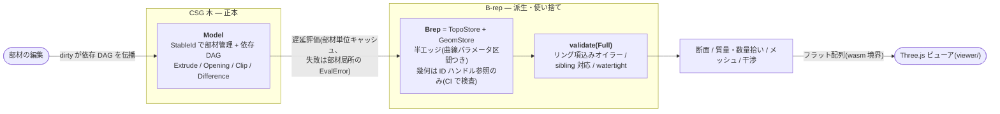

# archi-kernel

[](https://github.com/s-hosomi/archi-kernel/actions/workflows/ci.yml)
[](LICENSE)


**English version: [README.md](README.md)** / 設計の経緯と根拠は [DESIGN.md](DESIGN.md) に全て残してあります。

建築シミュレーションに特化した B-rep ジオメトリカーネルです。Rust 製で、実行時依存はゼロ(唯一の例外は Shewchuk の厳密述語 `robust` クレートで、述語モジュールの内側に閉じ込めてあります)。ネイティブでも、WebAssembly 経由でブラウザ上でも動きます。

<p align="center">
  
</p>

<p align="center">
  <b><a href="https://s-hosomi.github.io/archi-kernel/">▶ ライブデモ</a></b> — wasm 化したカーネルがブラウザ上でそのまま動きます
</p>

<p align="center">
  
</p>

*どちらも、カーネル自身が計算した結果をそのまま描いています。ソリッドは watertight なテッセレーション、朱色の断面は閉形式 `section()` の出力です。画面に見えている開口・切り欠き・円形断面は、すべてカーネルのブーリアン演算が作ったものです。*

## 何を狙ったカーネルか

汎用の B-rep カーネル(Parasolid、ACIS、Open CASCADE)には数百人年の蓄積があります。その大部分が注ぎ込まれているのは、曲面同士の交線を数値的に追跡する処理(marching)と、ブーリアン演算を浮動小数点の世界で壊れないようにするための膨大なノウハウです。このカーネルは、その土俵では戦いません。代わりに、建築の躯体が持つ 3 つの性質を徹底的に利用します。

**1. 曲面の種類が極端に少ない。**
壁・床・梁・柱は平面、丸柱・杭・スリーブ・ボイドは円筒です。この範囲に限定すれば、曲面同士の交線はすべて**閉形式**で解けます。平面×平面は直線、平面×円筒は円・楕円・母線 0〜2 本・接線のいずれかで、全ケースに解析解があります。数値追跡は存在しないので、収束失敗も存在しません。なお円筒×円筒だけは交線が 4 次空間曲線になり、交点が代数的数になるため厳密に扱えません。これを意図的にスコープ外としたこと自体が、頑健性のための設計判断です。

**2. 部材はみなプリズム(柱体)である。**
構造部材は「2D 断面を軸方向に押し出したもの」であり、開口もまたプリズムです。共通の押し出し方向を持つ 2 つのソリッドのブーリアンは、3D の問題から「**1 つのグローバル 2D アレンジメント × 軸方向の区間分割**」へと落ちます(直方体は 3 軸どの方向にもプリズムなので、直交する柱と梁の取り合いもこの形に落ちます)。3D で厄介な縮退 — 面同士のぴったり重なり、頂点と面の接触 — は次元が 1 つ下がって 2D の共線・一致になり、専用の 2D エンジン(`boolean/poly2d`:線分+円弧、スナップ付きアレンジメント+厳密 orient2d による winding 分類)が、摂動で誤魔化すのではなく正面から処理します。壁面・水平面・蓋がすべて**同じ**アレンジメント分割から生成されるため、共有エッジは厳密に対応し、watertight は「縫い合わせた結果」ではなく構造として成立します。

**3. 建築の寸法はレンジが固定で、格子に乗っている。**
寸法はおおよそ 1mm〜100m に収まるため、絶対トレランス 1 本(`Tol::length = 1e-6 m`)で足ります。さらに建築では「ぴったり一致」が日常です — スラブ面と壁面が同一平面にある、開口が壁の端にぴったり揃う。だから述語は最初から 3 値(`Sign3: Below / On / Above`)で、ON は誤差ではなく仕様です。共平面の面をどちらに残すかは、実行時に何となく決まるのではなく、反例テスト付きの真理値表(`boolean/coplanar_rules.rs`)として固定してあります。単一トレランスで防げないこと(比較の非推移性、トレランス汚染)も正直に文書化し、多層の検証で守る方針です。

## アーキテクチャ



- **正本は CSG 木で、B-rep はキャッシュにすぎません。** 評価は部材単位の push-dirty / pull-clean(トレランスもキャッシュキーに含む)。失敗したときは直前の正常な B-rep を表示用に残します。ブーリアンの失敗は、その部材だけに閉じた機械可読の `EvalError` になります — **壊れたジオメトリや、黙って間違った答えを返すことは決してありません**。2.5D の経路で扱えないものは扱えないと明示します(`Unsupported3dBoolean`、`PotentialClash`、`UnsupportedArcDegeneracy`)。
- **トポロジーは座標を一切持ちません。** `topo/` が持つのは ID と曲線パラメータ区間だけです(Fornjot がこの分離を崩して数ヶ月を失った教訓から、CI が `topo` での `math`/`primitives` の import を grep で禁止しています)。幾何は `geom/` にあり、**平面は登録時に正準化**されます。別々の部材が別々の浮動小数点経路で導いた「同じはずの平面」が 1 つのハンドルに統合される — これが共平面検出と sibling 対応の信頼性を支えています。
- **検証は後付けの確認ではなく、評価の一部です。** `validate()` は**リング項を含む**オイラー標数(`V − E + F − (L − F) = 2(S − G)`。窓のある壁は、リング項のない式では即座に不整合になります)、sibling 対応の完全性(同一曲線・逆向きパラメータ区間)、ループの連続性、幾何との整合を検査します。体積の恒等式 `V(A−B) + V(A∩B) = V(A)` は、円弧や Clip を含む 1,000 ケース超のランダム配置で property test しています。
- **ノードがドメインの意味を運びます。** `OpeningSubtraction`(IFC の IfcRelVoidsElement に相当)は汎用の `Difference` とは別の型で、おかげで型枠面積が木をたどるだけで計算できます。`Clip` は優先順位による控除(柱優先など)を表し、`base ∧ ¬開口 ∧ ¬クリッパー` という 1 つの集合演算として単一アレンジメントで評価されます(冪等なので二重控除は起きません)。モデル層の DAG により、柱を動かせばそれを控除している梁が自動的に再評価され、循環参照は関係する部材だけが隔離されます。

## ビューア(Three.js + wasm)

**ライブデモ: <https://s-hosomi.github.io/archi-kernel/>**(`main` から Pages ワークフローが自動デプロイ)

`viewer/` はビルド不要の Web アプリです。カーネルを WebAssembly にコンパイルし(`wasm/` は薄い wasm-bindgen アダプタで、ジオメトリはフラットな型付き配列、構造データはカーネル自身の serde JSON で受け渡します)、ES モジュールの Three.js シーンと組み合わせています。デモでは **3 層の RC オフィスビルを JavaScript 側で CSG モデルとして組み立てます**(約 160 部材)。最上階をセットバックさせた屋上テラスとスチール H 形鋼のパーゴラ、正面の丸柱コロネード、エントランスとキャノピーを持つ窓グリッドのファサード、全フロアを貫く階段・エレベーターコア、スリーブを通した大梁 — そして数量拾いの控除チェーン(柱 ▷ 大梁 ▷ 小梁 ▷ スラブ)まで、実務の構成をそのまま再現しています。あとはカーネルの仕事です:評価、watertight なメッシュ化、ライブ断面(キャップはカーネルが計算)、HUD のコンクリート量集計。

```bash
rustup target add wasm32-unknown-unknown   # 初回のみ
cargo install wasm-pack                    # 初回のみ
wasm-pack build wasm --target web --out-dir ../viewer/pkg --release
cd viewer && python3 -m http.server 8741
# http://localhost:8741 を開く — ドラッグで回転、「断面」トグルでライブカット
```

断面スライダーは、このカーネルの一番正直なデモです。動かすたびにビューアは `section_all()` を呼び、返ってきた閉形式のプロファイル(穴も円弧も含む)から朱色のキャップを作り直します。Three.js のクリッピングがやっているのは、平面より上を非表示にすることだけです。

## 実装状況(v0.3.x — ロードマップ Phase 0〜7 を実装済み)

- 解析プリミティブと閉形式交差、自前の math モジュール、panic しない `Result` コンストラクタ、`#[non_exhaustive]`、serde は optional feature
- 世代付き arena 上の半エッジトポロジー、平面の正準化ストア、一級 API としての検証
- 矩形・H 形・円形断面の任意軸押し出し
- ソリッド×半空間カット(エッジ分割は閉形式、共平面の蓋の規則、複数ループ・annulus キャップ、連結成分の分解)
- 2.5D prismatic ブーリアン(差・和・積、線分+円弧)、複数開口の一括処理、優先順位 Clip、複雑度上限と局所的な失敗隔離
- 断面:伏図・軸組図プロファイル(穴の入れ子、円弧エッジ、共平面規約の固定、部材ごとのエラー隔離)
- 質量・数量拾い:厳密な体積(斜め切断の楕円リム付き円筒パッチを含む)・重心・型枠面積の側面/底面分割(開口控除、柱との接触面の除外 — 公共建築数量積算基準)
- watertight テッセレーション(曲線単位の離散化を sibling 同士で共有。全エッジがちょうど 2 つの三角形に共有されることをテストで直接検証)
- 干渉チェック(AABB の粗判定 → prismatic 交差体積の精密判定。判定不能なペアは `PotentialClash` として正直に報告)とスリーブの規定検査
- wasm バインディングと Three.js ビューア(このページの画像はその出力です)
- 約 300 のテスト:手計算の解析解との照合、縮退ケースの専用スイート(敵対的レビューで見つかった実バグ 10 件の修正から生まれ、その後ビューアがさらに数件を発見)、1,000 ケース超の体積恒等式 property test

意図的にやっていないこと(実データが必要性を示すまで保留):プリズムに落ちないペアの汎用 3D ブーリアン(現状は明示エラー)、円筒×円筒、平面の厳密演算(`VertexGeom` を open enum にし、述語が implicit point を受けられる形で接合面だけ確保してあります — 投資判断は実測の失敗率を見てから)。

## 例:柱優先の数量拾い

```rust
use archi_kernel::csg::{ClipRule, CsgNode, Member, Profile2d, StableId};
use archi_kernel::math::{Point3, Vec3};
use archi_kernel::model::{takeoff, Model};
use archi_kernel::tolerance::Tol;

let tol = Tol::default();
let mut model = Model::new();

// 500×500 の RC 柱 2 本。高さ 3m、スパン 6m。
let column = |cx: f64| CsgNode::Extrude {
    profile: Profile2d::rect(0.25, 0.25).unwrap(),
    origin: Point3::new(cx, 0.0, 0.0),
    axis: Vec3::Z,
    length: 3.0,
};
model.insert(StableId(1), Member::new(column(0.0))).unwrap();
model.insert(StableId(2), Member::new(column(6.0))).unwrap();

// 400×600 の大梁(柱芯から柱芯まで)。柱優先で控除されるので、
// コンクリート体積は内法長さで算定される。
model.insert(StableId(3), Member::new(CsgNode::Clip {
    base: Box::new(CsgNode::Extrude {
        profile: Profile2d::rect(0.3, 0.2).unwrap(),
        origin: Point3::new(0.0, 0.0, 2.7),
        axis: Vec3::X,
        length: 6.0,
    }),
    clippers: vec![StableId(1), StableId(2)],
    rule: ClipRule::Priority,
})).unwrap();

let q = takeoff(&mut model, StableId(3), &tol).unwrap();
assert!((q.concrete_volume - 5.5 * 0.4 * 0.6).abs() < 1e-9); // 内法 5.5 m
// q.formwork_side == 6.6 m²(側面)、q.formwork_bottom == 2.2 m²(底面)。
// 柱と接する端面は型枠に計上されない。
```

断面(`section::section`)、メッシュ(`tess::tessellate`)、干渉レポート(`clash::clash_check`)も、同じ評価済みモデルから取り出せます。ネイティブでも wasm 経由でも同じです。

## 開発

```bash
cargo test --all-features                                   # 解析解照合 + 縮退 + property テスト
cargo clippy --all-targets --all-features -- -D warnings    # 警告ゼロ方針
cargo fmt --all -- --check
cargo check --no-default-features                           # serde feature は optional を維持
```

長さは SI のメートル、角度はラジアンに統一しています。単位変換(ST-Bridge の mm → m など)は呼び出し側アダプタの責務です。公開コンストラクタはすべて `Result` を返し、ユーザー入力でライブラリが panic することはありません。

## ライセンス

MIT — `LICENSE` を参照してください。
