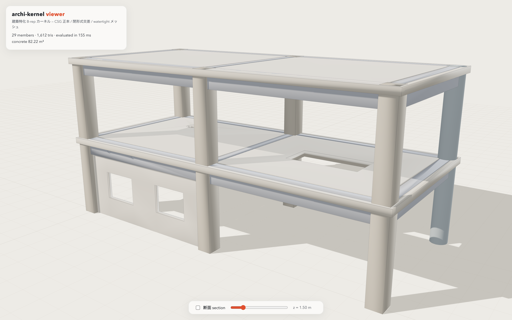
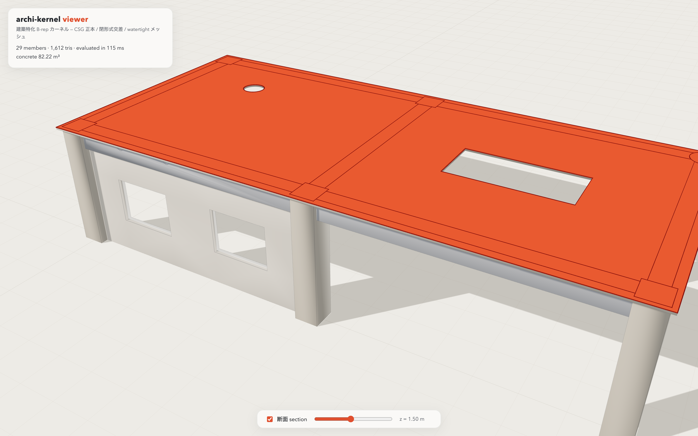

# archi-kernel

**English version: [README.md](README.md)** / 設計方針・調査記録・ロードマップの全文は [DESIGN.md](DESIGN.md)。

建築シミュレーション特化の B-rep ジオメトリカーネル。Rust 製・実行時依存ゼロ(唯一の例外は Shewchuk 厳密述語の `robust` クレートで、述語窓口の内側に隔離)。ネイティブでも、WebAssembly 経由でブラウザでも動く。

<p align="center">
  
</p>

<p align="center">
  
</p>

*2 枚ともカーネル自身の出力の描画である: ソリッドは watertight テッセレーション、断面(朱色のキャップと輪郭)は閉形式 `section()` のプロファイル。画面に見える開口・切り欠き・円形面はすべてカーネルのブーリアン演算が作ったもの。*

## 中核テーゼ

汎用 B-rep カーネル(Parasolid / ACIS / Open CASCADE)は数百人年の蓄積であり、その大半は「曲面×曲面交線の数値追跡(marching)」と「ブーリアンの浮動小数点頑健化の数十年分のノウハウ」に費やされている。本カーネルはその土俵で戦わない。代わりに建築躯体の 3 つの事実を利用する:

1. **曲面の語彙が極端に小さい。** 壁・床・梁・柱は平面、丸柱・杭・スリーブ・ボイドは円筒。この語彙なら全ての曲面交差が**閉形式**で解ける — 平面×平面=直線、平面×円筒=円/楕円/平行線 0〜2 本/接線。数値 marching は存在せず、収束失敗も存在しない。(円筒×円筒は 4 次空間曲線で交点が代数的数になるため意図的にスコープ外 — これは原理的に厳密化できない唯一の交差を避けるという、それ自体が頑健性の設計判断である)

2. **部材はプリズムである。** 構造部材は 2D 断面の押し出しであり、開口もプリズムである。**共通の prismatic 方向**を持つ 2 ソリッドのブーリアン — 直方体は 3 軸すべてに prismatic なので、直交する柱×梁もこれに該当する — は、3D 問題から「**1 つのグローバル 2D アレンジメント × 軸方向の区間分解**」に落ちる。3D の難所(共平面 face・頂点接触)は次元が 1 つ下がって 2D の共線・一致になり、専用 2D エンジン(`boolean/poly2d`: 線分+円弧、スナップ付きアレンジメント+厳密 orient2d による winding 分類)が摂動ハックではなく第一級市民として処理する。壁面・界面・蓋が**同一の**アレンジメント分割から生成されるため、共有エッジは厳密に対になり、watertight は縫合の結果ではなく構造的に成立する。

3. **建築は格子の上・固定スケールで生きている。** 寸法は約 1mm〜100m に収まるため、絶対トレランス 1 本(`Tol::length = 1e-6 m`)で足りる。そして「ぴったり一致」が常態(スラブ面と壁面が同一平面、開口が壁端に一致)なので、全述語は初日から 3 値(`Sign3: Below / On / Above`)— ON 帯はノイズではなく仕様である。共平面の残否は実行時に発見するものではなく、反例テスト付きの真理値表(`boolean/coplanar_rules.rs`)として固定してある。単一 ε にできないこと(非推移性・トレランス汚染)も正直に文書化し、防御は希望的観測ではなく多層の検証で行う。

## アーキテクチャ

```
CSG 木(正本)                       B-rep(派生・使い捨て)
┌──────────────────────────┐  遅延  ┌──────────────────────────────┐
│ Model: StableId で部材管理 │ ─────▶ │ Brep = TopoStore + GeomStore │
│ + 依存 DAG                │  評価  │ 曲線パラメータ区間つき半エッジ │
│ Extrude/Opening/Clip/…   │        │ 幾何は ID ハンドル参照のみ     │
└──────────────────────────┘        │ (CI で機械検査)              │
        ▲                           └──────────────────────────────┘
        │ push-dirty                        │ validate(Full): リング項込み
   編集が DAG を伝播                        │ オイラー・sibling 対・watertight
                                            ▼ — 一級 API
                                    断面 / 質量 / メッシュ / 干渉
                                            │ フラット配列(wasm 境界)
                                            ▼
                                    Three.js ビューア (viewer/)
```

- **CSG 木がドキュメントであり、B-rep はキャッシュである。** 評価は部材粒度の push-dirty / pull-clean(Tol をキーに含む)。失敗時は前回の有効 B-rep を表示用に保持。ブーリアンの失敗は部材局所の機械可読な `EvalError` であり、**壊れたジオメトリやサイレントな誤答には決してならない**。2.5D 経路で扱えないものは明示的にそう言う(`Unsupported3dBoolean`、`PotentialClash`、`UnsupportedArcDegeneracy`)
- **トポロジーは座標に触れない。** `topo/` は ID と曲線パラメータ区間のみを持つ(Fornjot の教訓: この分離は一度崩れると数ヶ月を失う)。CI が `topo` の `math`/`primitives` import を grep で禁止。幾何は `geom/` にあり、**平面は挿入時に正準化**される — 別部材が別の float 経路で導出した「同一のはずの平面」は 1 つのハンドルに統合され、これが共平面検出と sibling 対応の信頼性の土台になる
- **検証は後処理ではなく評価の一部。** `validate()` は**リング項込み**オイラー標数(`V − E + F − (L − F) = 2(S − G)` — 窓開口付きの壁はリング項なしの式を即座に破る)、sibling 対の完全性(同一曲線・逆パラメータ区間)、ループ連続性、幾何整合を検査する。体積恒等式 `V(A−B) + V(A∩B) = V(A)` は円弧・Clip 経路込みで 1,000 ケース超の property test
- **意味を持つノードがドメイン知識を運ぶ。** `OpeningSubtraction`(IFC の IfcRelVoidsElement 相当)は汎用 `Difference` と区別され、型枠面積が木走査で出る。`Clip` は優先順位控除(柱優先)を表し、`base ∧ ¬開口 ∧ ¬クリッパー` のフラットな集合演算として単一アレンジメントで評価される(冪等なので二重控除が起きない)。モデル層 DAG が「柱を動かしたら梁が再評価される」を実現し、循環依存は関係部材だけを隔離する

## ビューア(Three.js + wasm)

`viewer/` はビルドステップ不要の Web アプリ。カーネルを WebAssembly にコンパイルし(`wasm/`: 薄い wasm-bindgen アダプタ — ジオメトリはフラット型付き配列、構造データはカーネル自身の serde JSON)、ES モジュールの Three.js シーンと組み合わせる。デモは **2 層 RC ラーメンを JavaScript 上で CSG モデルとして構築**する — 柱、柱優先でクリップされた大梁、梁に控除された開口付きスラブ(階段開口+丸ダクト)、窓付きの壁、丸柱、スリーブ付き梁 — あとはカーネルの仕事: 評価、watertight メッシュ化、ライブ断面(キャップはカーネル計算)、HUD のコンクリート量集計。

```bash
rustup target add wasm32-unknown-unknown   # 初回のみ
cargo install wasm-pack                    # 初回のみ
wasm-pack build wasm --target web --out-dir ../viewer/pkg --release
cd viewer && python3 -m http.server 8741
# http://localhost:8741 を開く — ドラッグで回転、「断面」トグルでライブカット
```

断面スライダーはカーネルの正直なデモになっている: 動かすたびにビューアは `section_all()` を呼び、返ってきた閉形式プロファイル(穴・円弧つき)から朱色のキャップを作り直す。Three.js のクリッピングは平面より上の表示を隠しているだけである。

## 実装状況(v0.3.x — ロードマップ Phase 0〜7 実装済み)

- 解析プリミティブ+閉形式交差、自前 math モジュール、panic-free な `Result` コンストラクタ、`#[non_exhaustive]`、serde は optional feature
- 世代付き arena 上の半エッジトポロジー、平面正準化ストア、一級の検証 API
- 矩形・H 形・円形断面の任意軸押し出し
- ソリッド×半空間カット(閉形式エッジ分割、共平面 lid 規則、複数ループ/annulus キャップ、連結成分分解)
- 2.5D prismatic 差・和・積(線分+円弧)、N 開口の一括処理、優先順位 Clip、複雑度バジェットと局所失敗隔離
- 断面: 伏図/軸組プロファイル(穴の入れ子・円弧エッジ・共平面 face 規約の固定・部材別エラー隔離)
- 質量・数量拾い: 厳密体積(斜め楕円リム円筒パッチ含む)、重心、型枠面積の側面/底面分割(開口控除・柱接触面の除外 — 公共建築数量積算基準)
- watertight テッセレーション(曲線単位の離散化を sibling が共有。全エッジが正確に 2 三角形に共有されることをテストで直接検証)
- 干渉チェック(AABB 粗判定 → 厳密 prismatic 交差体積、正直な `PotentialClash` 縮退)とスリーブ規定検査
- wasm バインディング + Three.js ビューア(このページのスクリーンショット)
- 約 290 テスト: 手計算の解析解照合、敵対的縮退スイート(敵対的レビューが実バグ 10 件を発見・修正した産物 — さらにビューアが即座に 2 件を発見した)、1,000 ケース超の体積恒等式 property test

意図的なスコープ外(実データが要求するまで保留): 非 prismatic ペアの一般 3D ブーリアン(現在は明示エラー)、円筒×円筒、平面の厳密演算(`VertexGeom` は open enum、述語は implicit point を受ける形でデータ構造の接合面だけ確保済み — 投資判断は実測の失敗率を見てから)。

## 例: 柱優先の数量拾い

```rust
use archi_kernel::csg::{ClipRule, CsgNode, Member, Profile2d, StableId};
use archi_kernel::math::{Point3, Vec3};
use archi_kernel::model::{takeoff, Model};
use archi_kernel::tolerance::Tol;

let tol = Tol::default();
let mut model = Model::new();

// 500×500 の RC 柱 2 本、高さ 3m、6m スパン。
let column = |cx: f64| CsgNode::Extrude {
    profile: Profile2d::rect(0.25, 0.25).unwrap(),
    origin: Point3::new(cx, 0.0, 0.0),
    axis: Vec3::Z,
    length: 3.0,
};
model.insert(StableId(1), Member::new(column(0.0))).unwrap();
model.insert(StableId(2), Member::new(column(6.0))).unwrap();

// 400×600 の大梁(柱芯〜柱芯)。柱優先で控除され、体積は内法長さで出る。
model.insert(StableId(3), Member::new(CsgNode::Clip {
    base: Box::new(CsgNode::Extrude {
        profile: Profile2d::rect(0.3, 0.2).unwrap(),
        origin: Point3::new(0.0, 0.0, 2.7),
        axis: Vec3::X,
        length: 6.0,
    }),
    clippers: vec![StableId(1), StableId(2)],
    rule: ClipRule::Priority,
})).unwrap();

let q = takeoff(&mut model, StableId(3), &tol).unwrap();
assert!((q.concrete_volume - 5.5 * 0.4 * 0.6).abs() < 1e-9); // 内法 5.5 m
// q.formwork_side == 6.6 m²(側面)、q.formwork_bottom == 2.2 m²(底面)。
// 柱との接触面は型枠から控除されている。
```

断面(`section::section`)・メッシュ(`tess::tessellate`)・干渉レポート(`clash::clash_check`)も同じ評価済みモデルから読み出せる — ネイティブでも wasm 経由でも。

## 開発

```bash
cargo test --all-features                                   # 解析解照合 + 敵対的 + property テスト
cargo clippy --all-targets --all-features -- -D warnings    # 警告ゼロポリシー
cargo fmt --all -- --check
cargo check --no-default-features                           # serde feature は optional を維持
```

長さは SI メートル、角度はラジアンのみ。単位変換(ST-Bridge の mm → m、×1e-3 など)は呼び出し側アダプタの責務。公開コンストラクタは全て `Result` を返し、ライブラリはユーザー入力で panic しない。

## ライセンス

MIT — `LICENSE` を参照。
