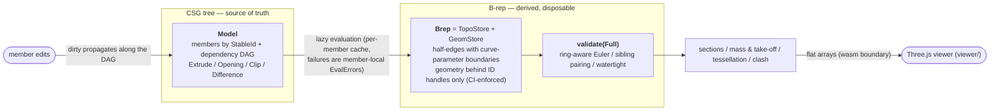

# archi-kernel

[](https://github.com/s-hosomi/archi-kernel/actions/workflows/ci.yml)
[](LICENSE)


**日本語版は [README.ja.md](README.ja.md) へ。** 設計方針・調査記録・ロードマップは [DESIGN.md](DESIGN.md)(日本語)。

A domain-specific B-rep geometry kernel for building simulation, written in Rust with zero runtime dependencies (one exception: Shewchuk's exact predicates via the `robust` crate, isolated behind a single predicate facade). Runs natively and in the browser via WebAssembly.

<p align="center">
  
</p>

<p align="center">
  
</p>

*Both images are the bundled Three.js viewer rendering the kernel's own output: watertight tessellation for the solids, and closed-form `section()` profiles (vermilion caps and outlines) recomputed live as the plane moves — every opening, notch and round face you see was produced by the kernel's booleans.*

## The thesis

General-purpose B-rep kernels (Parasolid, ACIS, Open CASCADE) are hundreds of person-years deep, and most of that depth pays for two things: numerical surface-surface intersection (marching) and decades of float-robustness folklore in booleans. This kernel refuses to compete on that ground. Instead it exploits three facts about building structures:

1. **The surface vocabulary is tiny.** Walls, slabs, beams and columns are planes; round columns, piles, sleeves and voids are circular cylinders. Within that vocabulary every surface-surface intersection has a *closed form* — plane × plane is a line, plane × cylinder is a circle / ellipse / 0–2 rulings / tangent line, all solved analytically in `intersect/`. No marching, no convergence failures. (Cylinder × cylinder is a degree-4 space curve whose points are algebraic numbers — it is deliberately out of scope, and that exclusion is itself a robustness decision: it is the one intersection that cannot be made exact even in principle.)

2. **Members are prisms.** A structural member is a 2-D profile swept along an axis, and openings are prisms too. A boolean between two solids that share a *prismatic direction* — note: a box is prismatic along all three of its axes, which is why an orthogonal column × girder intersection qualifies — collapses from a 3-D problem to **one global 2-D arrangement × an interval decomposition along the common axis**. The hard 3-D degeneracies (coplanar faces, vertex-on-face contact) drop a dimension and become 2-D collinear/coincident cases, which a purpose-built 2-D engine (`boolean/poly2d`, segments + circular arcs, snap-rounded arrangement + winding classification over exact orientation predicates) handles as first-class citizens rather than as perturbation hacks. Walls, interface caps and lids are all generated from the *same* arrangement segmentation, so shared edges pair exactly and watertightness is structural, not stitched after the fact.

3. **Buildings live on a grid, at fixed scale.** Dimensions range from ~1 mm to ~100 m, so a single absolute tolerance (`Tol::length = 1e-6 m`) suffices — no scale-adaptive tolerancing. And because exact coincidence is the *common case* (slab face on wall face, opening flush with a wall edge), every predicate is 3-valued from day one (`Sign3: Below / On / Above`); the ON band is specification, not noise. Coplanar keep/drop semantics are fixed as a truth table with counterexample tests (`boolean/coplanar_rules.rs`), not discovered at runtime. We are explicit about what a single ε cannot do (non-transitivity, tolerance contamination) — the defence is layered validation, not wishful thinking.

## Architecture



- **The CSG tree is the document; the B-rep is a cache.** Evaluation is push-dirty / pull-clean at member granularity, keyed by tolerance, with the previous valid B-rep retained for display fallback. A failed boolean is a member-local, machine-readable `EvalError` — never corrupted geometry, never a silent wrong answer. Anything the 2.5-D path cannot handle says so explicitly (`Unsupported3dBoolean`, `PotentialClash`, `UnsupportedArcDegeneracy`).
- **Topology never touches coordinates.** `topo/` stores only IDs and curve-parameter boundaries (the Fornjot lesson: this separation, once lost, costs months); CI greps that `topo` imports neither `math` nor `primitives`. Geometry lives in `geom/`, where planes are *canonicalised on insertion* — two members deriving "the same" plane through different float paths get one surface handle, which is what makes coplanar detection and sibling pairing reliable.
- **Validation is part of evaluation, not an afterthought.** `validate()` checks the Euler characteristic *with the ring term* (`V − E + F − (L − F) = 2(S − G)` — a wall with a window breaks the ring-free formula immediately), sibling-pair completeness (same curve, reversed parameter boundary), loop continuity, and geometric coherence. Volume identities (`V(A−B) + V(A∩B) = V(A)`) are property-tested across thousands of randomized configurations, including arcs and clip paths.
- **Semantic nodes carry domain meaning.** `OpeningSubtraction` (an IFC `IfcRelVoidsElement` analogue) is distinct from generic `Difference` so formwork areas can be computed by tree walk; `Clip` expresses priority deduction (column over girder) and is evaluated as one flat set-theoretic expression `base ∧ ¬openings ∧ ¬clippers` in a single arrangement — idempotent, so no double deduction. The model-level DAG re-evaluates dependents when a clipped member moves and isolates dependency cycles to exactly the members involved.

## The viewer (Three.js + wasm)

**Live demo: <https://s-hosomi.github.io/archi-kernel/>** (deployed from `main` by the Pages workflow).

`viewer/` is a no-build-step web app: the kernel compiled to WebAssembly (`wasm/`, thin `wasm-bindgen` adapter — flat typed arrays for geometry, the kernel's serde JSON for everything structured) plus an ES-module Three.js scene. The demo constructs a three-storey RC office block *as a CSG model in JavaScript* (~160 members): a set-back top floor with a roof terrace and a steel H-section pergola, a round-column colonnade along the front, window-grid facades with an entrance and canopy, a stair/elevator core whose voids stack through every slab, sleeved girders, and the full quantity-take-off deduction chain — columns over girders over beams over slabs. The kernel does the rest: evaluation, watertight meshing, live section planes with kernel-computed caps, and a running concrete-volume total in the HUD.

```bash
rustup target add wasm32-unknown-unknown   # once
cargo install wasm-pack                    # once
wasm-pack build wasm --target web --out-dir ../viewer/pkg --release
cd viewer && python3 -m http.server 8741
# open http://localhost:8741 — drag to orbit, toggle 断面 to cut the model live
```

The section slider is an honest demo of the kernel: every time you move it, the viewer calls `section_all()` and rebuilds the vermilion caps from the returned closed-form profiles (with holes and arcs), while Three.js clipping merely hides the geometry above the plane.

## Status (v0.3.x — roadmap Phases 0–7 implemented)

- Analytic primitives + closed-form intersections; self-contained math module; panic-free `Result` constructors; `#[non_exhaustive]` enums; optional `serde`
- Half-edge topology on generational arenas; canonical plane store; first-class validation
- Extrusion of rectangular / H-section / circular profiles along arbitrary axes
- Solid × half-space cut (closed-form edge splitting, coplanar lid rules, multi-loop and annulus caps, connected-component splitting)
- 2.5-D prismatic difference / union / intersection (segments + arcs), N-operand opening batching, priority clips, complexity budgets and local failure isolation
- Sections: plan/elevation profiles with hole nesting, arc edges (traversal-ordered signed sweeps), fixed coplanar-face convention, per-member error isolation
- Mass & quantity take-off: exact volumes (incl. oblique elliptical cylinder patches), centroids, formwork side/bottom split with opening deduction and column-contact exclusion (公共建築数量積算基準)
- Watertight tessellation (per-curve discretisation shared between siblings; every mesh edge verified to appear in exactly two opposite triangles); flat arrays for Three.js / FEM
- Clash detection (AABB broad phase → exact prismatic intersection volume; honest `PotentialClash` degradation) and sleeve rule checks
- wasm bindings + Three.js viewer (this page's screenshots)
- ~290 tests: hand-computed analytic references, adversarial degeneracy suites (born from an adversarial review that found and fixed 10 real defects — and a viewer that immediately found two more), >1,000-case volume-identity property tests

Out of scope, by design, until real data demands them: general 3-D booleans between non-prismatic pairs (explicit error today), cylinder × cylinder, exact plane arithmetic (the data structures reserve the seam — `VertexGeom` is an open enum and predicates accept implicit points — but the investment waits for measured failure rates).

## Example: column-priority quantity take-off

```rust
use archi_kernel::csg::{ClipRule, CsgNode, Member, Profile2d, StableId};
use archi_kernel::math::{Point3, Vec3};
use archi_kernel::model::{takeoff, Model};
use archi_kernel::tolerance::Tol;

let tol = Tol::default();
let mut model = Model::new();

// Two 500×500 RC columns, 3 m tall, 6 m apart.
let column = |cx: f64| CsgNode::Extrude {
    profile: Profile2d::rect(0.25, 0.25).unwrap(),
    origin: Point3::new(cx, 0.0, 0.0),
    axis: Vec3::Z,
    length: 3.0,
};
model.insert(StableId(1), Member::new(column(0.0))).unwrap();
model.insert(StableId(2), Member::new(column(6.0))).unwrap();

// A 400×600 girder spanning centre-to-centre, deducted by the columns
// (column priority): its concrete volume uses the inner-clear length.
model.insert(StableId(3), Member::new(CsgNode::Clip {
    base: Box::new(CsgNode::Extrude {
        profile: Profile2d::rect(0.3, 0.2).unwrap(),
        origin: Point3::new(0.0, 0.0, 2.7),
        axis: Vec3::X,
        length: 6.0,
    }),
    clippers: vec![StableId(1), StableId(2)],
    rule: ClipRule::Priority,
})).unwrap();

let q = takeoff(&mut model, StableId(3), &tol).unwrap();
assert!((q.concrete_volume - 5.5 * 0.4 * 0.6).abs() < 1e-9); // inner-clear 5.5 m
// q.formwork_side == 6.6 m² (web faces), q.formwork_bottom == 2.2 m² (soffit);
// the column-contact end faces carry no formwork.
```

Sections (`section::section`), meshes (`tess::tessellate`) and clash reports (`clash::clash_check`) read off the same evaluated model — natively or through the wasm bindings.

## Development

```bash
cargo test --all-features                                   # analytic + adversarial + property tests
cargo clippy --all-targets --all-features -- -D warnings    # zero-warning policy
cargo fmt --all -- --check
cargo check --no-default-features                           # serde feature must stay optional
```

All lengths are SI metres, angles in radians; unit conversion (e.g. ST-Bridge millimetres, ×1e-3) belongs to the calling adapter. Every public constructor returns `Result`; the library does not panic on user input.

## License

MIT — see `LICENSE`.
